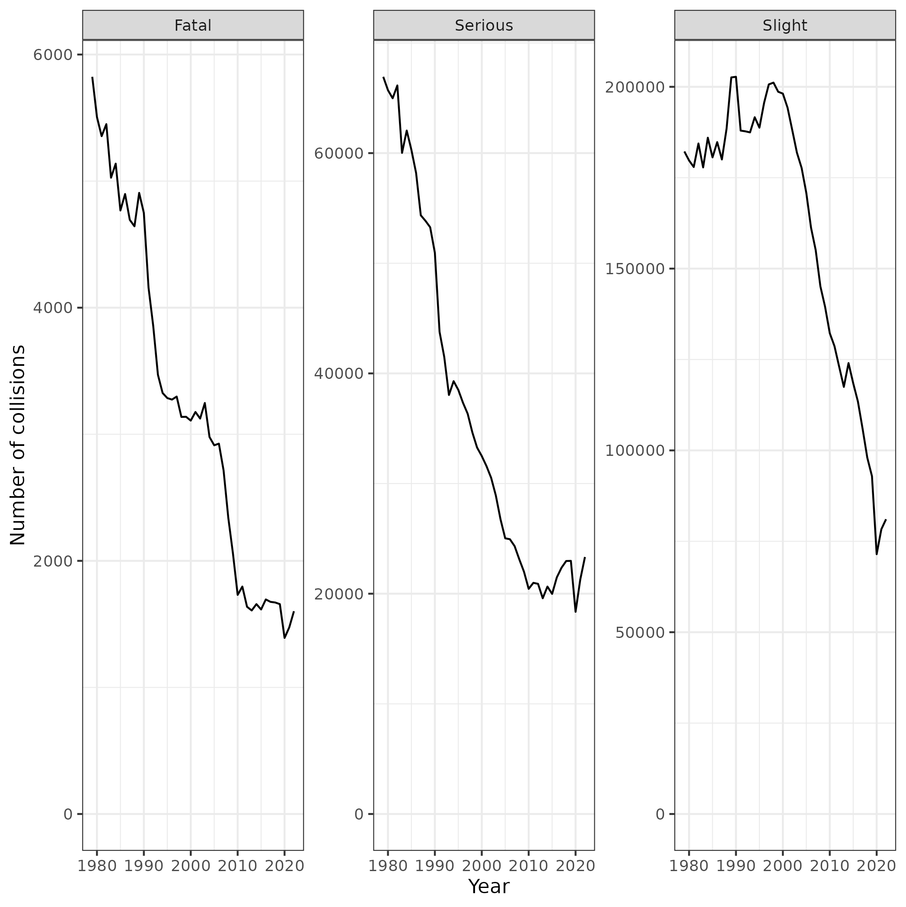
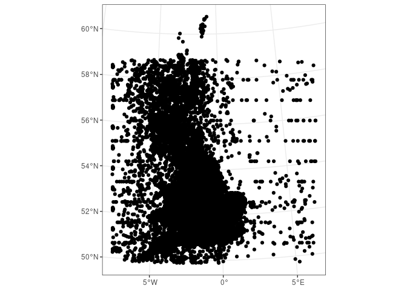

# 30 Day Map Challenge: Day 1
Robin Lovelace

This map shows road traffic fatalities in Great Britain.

``` r
remotes::install_dev("stats19")
```

    Using github PAT from envvar GITHUB_PAT

    Skipping install of 'stats19' from a github remote, the SHA1 (6ee28fbd) has not changed since last install.
      Use `force = TRUE` to force installation

``` r
remotes::install_dev("gganimate")
```

    Using github PAT from envvar GITHUB_PAT

    Skipping install of 'gganimate' from a github remote, the SHA1 (facc6725) has not changed since last install.
      Use `force = TRUE` to force installation

``` r
library(tidyverse)
```

    ── Attaching core tidyverse packages ──────────────────────── tidyverse 2.0.0 ──
    ✔ dplyr     1.1.3          ✔ readr     2.1.4     
    ✔ forcats   1.0.0          ✔ stringr   1.5.0     
    ✔ ggplot2   3.4.4.9000     ✔ tibble    3.2.1     
    ✔ lubridate 1.9.3          ✔ tidyr     1.3.0     
    ✔ purrr     1.0.2          
    ── Conflicts ────────────────────────────────────────── tidyverse_conflicts() ──
    ✖ dplyr::filter() masks stats::filter()
    ✖ dplyr::lag()    masks stats::lag()
    ℹ Use the conflicted package (<http://conflicted.r-lib.org/>) to force all conflicts to become errors

``` r
library(gganimate)
library(arrow)
```

    Some features are not enabled in this build of Arrow. Run `arrow_info()` for more information.

    Attaching package: 'arrow'

    The following object is masked from 'package:lubridate':

        duration

    The following object is masked from 'package:utils':

        timestamp

``` r
library(stats19)
```

    Data provided under OGL v3.0. Cite the source and link to:
    www.nationalarchives.gov.uk/doc/open-government-licence/version/3/

``` r
collisions = get_stats19(year = 1979)
# Show number of collisions recorded each year:
names(collisions)
```

``` r
collisions |>
  count(accident_year, accident_severity) |>
  ggplot(aes(x = accident_year, y = n)) +
  geom_path() +
  labs(x = "Year", y = "Number of collisions") +
  # Facet with free scales:
  facet_wrap(~accident_severity, scales = "free_y") +
  theme_bw() +
  # set y limit to 0, NA:
  coord_cartesian(ylim = c(0, NA))
ggsave("collisions-time.png")
```



``` r
fatalities = collisions |>
  filter(accident_severity == "Fatal")
# Save as parquet file:
write_csv(fatalities, "fatalities.csv")
```

``` r
fatalities = read_csv("fatalities.csv")
```

    Rows: 141698 Columns: 37
    ── Column specification ────────────────────────────────────────────────────────
    Delimiter: ","
    chr  (26): accident_index, accident_reference, police_force, accident_severi...
    dbl   (8): accident_year, location_easting_osgr, location_northing_osgr, lon...
    dttm  (1): datetime
    date  (1): date
    time  (1): time

    ℹ Use `spec()` to retrieve the full column specification for this data.
    ℹ Specify the column types or set `show_col_types = FALSE` to quiet this message.

``` r
fatalities_sf = format_sf(fatalities)
```

    202 rows removed with no coordinates

``` r
nrow(fatalities_sf)
```

    [1] 141496

``` r
diff(range(fatalities_sf$accident_year)) + 1
```

    [1] 44

``` r
nrow(fatalities_sf)
```

    [1] 141496

``` r
round(nrow(fatalities_sf) / diff(range(fatalities_sf$accident_year)) + 1)
```

    [1] 3292

``` r
# 3k per year
table(fatalities_sf$accident_year)
```


    1979 1980 1981 1982 1983 1984 1985 1986 1987 1988 1989 1990 1991 1992 1993 1994 
    5791 5500 5355 5449 5027 5134 4768 4890 4622 4643 4901 4744 4156 3853 3464 3320 
    1995 1996 1997 1998 1999 2000 2001 2002 2003 2004 2005 2006 2007 2008 2009 2010 
    3285 3272 3297 3136 3109 3102 3166 3124 3247 2978 2913 2926 2714 2341 2057 1731 
    2011 2012 2013 2014 2015 2016 2017 2018 2019 2020 2021 2022 
    1797 1637 1608 1658 1616 1695 1676 1670 1658 1391 1473 1602 

``` r
# Basic plot
fatalities_sf |>
  ggplot() +
  geom_sf() +
  theme_bw()
```



``` r
# Animated plot for each year with gganimate:
# transform to EPSG 4326:
fatalities_sf = fatalities_sf |>
  sf::st_transform(crs = "EPSG:4326")
uk_plus = rnaturalearth::ne_countries(scale = "medium", returnclass = "sf") |>
  # filter(name == "United Kingdom")
  # Matches UK, France, Ireland:
  filter(name %in% c("United Kingdom", "Ireland", "France"))

g_animated = fatalities_sf |>
  # filter(accident_year < 1980) |> # test failed
  # Test with random 1% sample:
  # sample_frac(size = 0.01) |>
  ggplot() +
  geom_sf() +
  # Set bounding box to UK:
  geom_sf(data = uk_plus, fill = NA, color = "black") +
  theme_bw() +
  coord_sf(xlim = c(-10, 2), ylim = c(49, 61)) +
  # Add title with year in form "Road traffic fatalities in 1979":
  labs(title = "Road traffic fatalities in {round(frame_time)}") +
  # Add watermark: "Robin Lovelace with data from the {stats19} R package" 
  labs(caption = "By Robin Lovelace. Source: Department for Transport data imported with the {stats19} package") +
  # Remove internal axis from plot:
  theme(
    axis.ticks = element_blank(),
    axis.text = element_blank(),
    plot.caption = element_text(size = 10, color = "grey"),
    plot.title = element_text(size = 28)
  ) +
  transition_time(accident_year)
# save result to fatalities_1979_2022.gif:
anim = animate(g_animated, fps = 3, width = 600, height = 800)
anim
anim_save("fatalities_1979_2022.gif", anim)
browseURL("fatalities_1979_2022.gif")
list.files(pattern = "gif")
```


